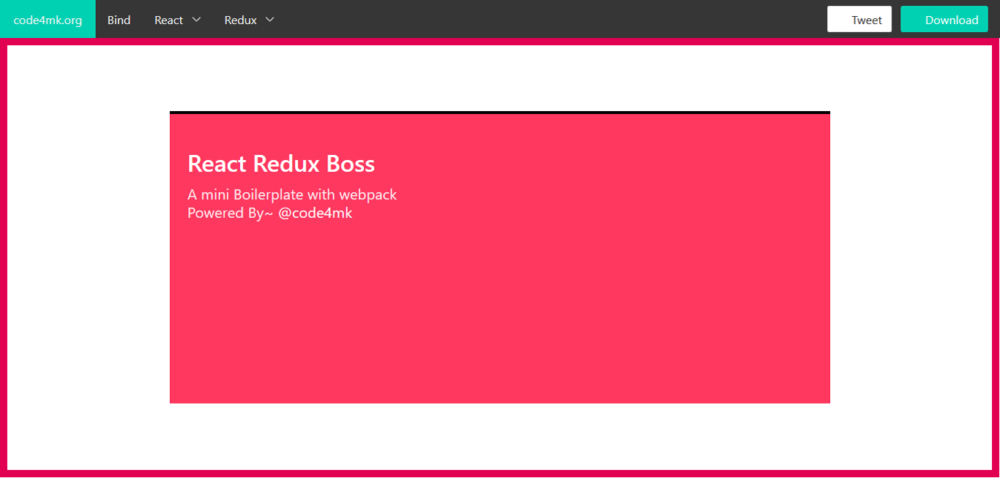

# react-redux-boss (RRB)
RRB is a mini React Redux boilerplate .

# Main Feature:

 - React
 - React Router Dom
 - Redux (coming soon)
 - Axios
 - Bulma

# How use RRB

 * `Clone RRB project`
 * `yarn install` or `npm install`
 * `npm run dev`

# Our React Atom Packages:
 - `apm install atom-react`
 - `apm install atom-axios`

 
 <a href="https://code4mk.org/" >
 <a href="https://twitter.com/code4mk" >
